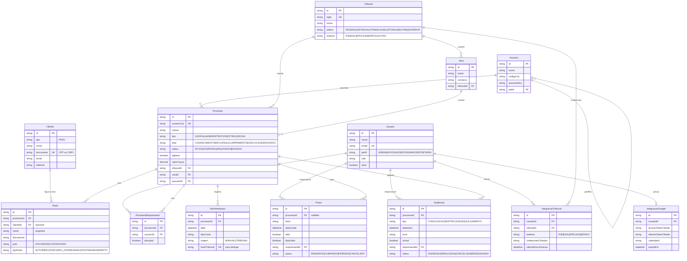

# Modelo de Dados

Este documento descreve o modelo de domínio da plataforma de gestão de processos
do escritório Donnici Advogados. Ele é a referência funcional para o schema
Prisma e para a evolução da aplicação.

## Introdução ao domínio

A operação de um escritório de advocacia gira em torno de **processos judiciais**.
Cada processo tem um número padronizado pelo CNJ (Conselho Nacional de Justiça),
tramita em uma **vara** (unidade jurisdicional) de um **tribunal**, e envolve
**partes** em dois lados opostos — o **polo ativo** (quem propõe a ação) e o
**polo passivo** (contra quem a ação é proposta). Pode haver ainda terceiros
(assistentes, intervenientes, peritos, testemunhas).

No dia a dia, o escritório acompanha as **movimentações** (andamentos publicados
pelo tribunal ou anotações internas) e controla **prazos** processuais — alguns
deles **fatais**, ou seja, aqueles cujo descumprimento gera preclusão e prejuízo
direto ao cliente. Também há **audiências** marcadas pelo juízo. Boa parte desse
fluxo pode ser automatizada por meio de integrações com os sistemas oficiais dos
tribunais (PJe, eSAJ, Projudi, eProc) e com o Google Calendar.

A modelagem busca separar com clareza três blocos:

1. **Cadastros estruturais** — usuários do escritório, clientes, taxonomia
   (tribunais, varas, assuntos).
2. **Operação processual** — processos, partes, responsáveis, movimentações,
   prazos e audiências.
3. **Integrações** — credenciais cifradas para tribunais e tokens OAuth do
   Google.

## Diagrama ER

## Entidades

### Usuario

Representa um membro da equipe do escritório com acesso à plataforma.

- `perfil` controla autorizações: `ADMIN` (configuração geral), `ADVOGADO`
  (subscreve peças, é responsável por processos), `ESTAGIARIO` (atua sob
  supervisão), `SECRETARIA` (apoio administrativo).
- `oab` é opcional — obrigatório apenas para advogados.
- `ativo` permite desativar usuários sem perder histórico (não excluímos
  pessoas que já figuraram como responsáveis).

### Cliente

Pessoa física ou jurídica representada pelo escritório.

- `tipo` define o conjunto de campos esperados (CPF vs. CNPJ, nome vs. razão
  social).
- `documento` é único no sistema para evitar cadastros duplicados.
- Um cliente pode figurar em vários processos, em polos diferentes (raro, mas
  possível em litígios cruzados).

### Assunto

Taxonomia dos assuntos jurídicos, alinhada à tabela de assuntos do CNJ.

- `codigoCnj` permite cruzar com a classificação oficial.
- `areaJuridica` agrupa assuntos por área (Cível, Trabalhista, Tributário,
  etc.) para relatórios.
- Auto-relacionamento `paiId` modela hierarquia (assunto e subassunto).

### Tribunal

Catálogo dos tribunais em que o escritório atua.

- `sigla` (ex.: `TJSP`, `TRF3`, `TRT2`) é a chave natural.
- `esfera` distingue justiças (federal, estadual, do trabalho, eleitoral,
  militar, superior).
- `sistema` indica o sistema processual eletrônico predominante; é o que o
  conector de integração usa para escolher o adapter.

### Vara

Unidade jurisdicional dentro de um tribunal.

- `comarca` é redundante mas útil para busca textual.
- Um processo pode mudar de vara ao longo do tempo (declínio de competência);
  o campo na `Processo` reflete a vara **atual**.

### Processo

Entidade central do sistema.

- `numeroCnj` é único — é o identificador externo do processo e a chave para
  deduplicação na importação.
- `classe` é livre (CPC e legislações específicas têm dezenas: Procedimento
  Comum, Execução Fiscal, Mandado de Segurança, etc.).
- `tipo` separa judicial de administrativo e extrajudicial (procedimentos
  notariais, mediações privadas).
- `fase` modela o estágio macro do processo: **conhecimento** (apuração de
  fatos e direito), **recursal** (em grau recursal), **cumprimento** (de
  sentença) ou **execução**.
- `status` é o estado operacional (ativo, suspenso, arquivado, baixado).
- `sigiloso` afeta visibilidade na interface; é também relevante para a
  política de integração (não logar conteúdo).
- `valorCausa` pode ser nulo (nem todo processo tem valor atribuído).

### Parte

Vínculo entre um processo e quem figura nele.

- `clienteId` é opcional: partes adversas (e terceiros) **não** se tornam
  clientes do escritório, mas precisam estar no processo.
- `nome` e `documento` são duplicados (snapshot) para casos em que a parte
  não é cliente.
- `polo` indica o lado (ativo, passivo, terceiro).
- `tipoParte` detalha o papel processual (autor, réu, perito, etc.).

### ProcessoResponsavel

Associa usuários do escritório a um processo, com flag `principal` indicando
o titular. Há normalmente um principal e, opcionalmente, colaboradores
(estagiário, segundo advogado).

### Movimentacao

Linha do tempo do processo.

- `origem = MANUAL` quando lançada por um membro da equipe.
- `origem = TRIBUNAL` quando vinda da sincronização automática.
- `hashTribunal` é um hash determinístico do conteúdo retornado pelo
  tribunal (sistema + número do processo + data + descrição), usado para
  evitar inserir o mesmo andamento duas vezes em sincronizações sucessivas.

### Prazo

Compromissos com data-limite.

- `fatal = true` sinaliza que o descumprimento acarreta preclusão; a UI
  destaca esses prazos e dispara alertas mais cedo.
- `diasUteis = true` indica que a contagem deve respeitar dias úteis
  (regra geral do CPC desde 2015); quando `false`, são dias corridos.
- `processoId` é opcional para permitir prazos administrativos do escritório
  (ex.: vencimento de procuração) que não estão ligados a um processo.
- `responsavelId` aponta para o usuário encarregado de cumprir o prazo.

### Audiencia

Sessões marcadas pelo juízo.

- `tipo` cobre as variações comuns (conciliação, instrução, audiência **una**
  — que reúne conciliação, instrução e julgamento em um único ato — e
  julgamento).
- `virtual` indica se ocorre por videoconferência; nesse caso `local` guarda
  a URL da sala.
- Sincroniza com Google Calendar quando o responsável tiver
  `IntegracaoGoogle` ativa.

### IntegracaoTribunal

Credenciais de acesso de um usuário a um sistema de tribunal.

- A chave funcional é o trio (`usuarioId`, `tribunalId`, `sistema`).
- `credenciaisCifradas` é um blob (JSON cifrado) cujo formato varia conforme
  o sistema (usuário/senha, certificado, token).
- A cifragem acontece na aplicação (ver decisão abaixo).

### IntegracaoGoogle

Conexão OAuth com o Google Calendar do usuário.

- `accessTokenCifrado` e `refreshTokenCifrado` são cifrados na aplicação.
- `calendarId` permite ao usuário escolher um calendário específico (ex.: um
  calendário "Donnici" separado do pessoal).

## Decisões de design

### Cliente é separado de Parte

Modelar parte adversa como `Cliente` seria errado: a parte adversa nunca é
representada pelo escritório, não tem dados de cobrança nem contrato e não
deve aparecer em telas de relacionamento. Por isso `Parte` é uma entidade
própria, com `clienteId` opcional — quando a parte é um cliente do escritório,
o vínculo está preenchido; quando é uma parte adversa ou terceiro, apenas os
campos snapshot (`nome`, `documento`) são preenchidos.

### `Prazo.responsavelId` com `onDelete: SetNull`

Prazos são registros históricos sensíveis (especialmente os fatais
descumpridos: importam para auditoria interna e eventual responsabilização).
Se um usuário for removido, queremos preservar o prazo com o responsável
"desconhecido" em vez de cascatear a exclusão. O mesmo raciocínio se aplica
a `Audiencia.responsavelId`.

### Credenciais cifradas na aplicação, não no banco

Optamos por cifrar `credenciaisCifradas` e os tokens do Google **na camada de
aplicação** (com chave mantida fora do banco — por exemplo em variável de
ambiente ou KMS) em vez de usar `pgcrypto` ou TDE. Vantagens:

- Um dump do banco não expõe segredos a quem não tenha a chave da aplicação.
- Independência de versão/extensão do PostgreSQL.
- A rotação de chave é uma operação de aplicação, controlável em código.
- Mantém o schema simples (campos `text`) e portável para outros provedores
  de Postgres gerenciado.

### `Processo.numeroCnj` é `unique`

O número CNJ é um identificador nacional padronizado (formato
`NNNNNNN-DD.AAAA.J.TR.OOOO`). Tornando-o único:

- Evitamos cadastros duplicados quando dois usuários inserem o mesmo
  processo.
- Permitimos `upsert` por `numeroCnj` na sincronização com tribunais.
- A integração consegue resolver referências sem precisar de mapeamento
  externo.

### `Movimentacao.hashTribunal` para deduplicação

As APIs/scrapers dos tribunais não expõem um ID estável e único por
movimentação. Para evitar duplicar andamentos a cada sincronização,
computamos um hash determinístico a partir dos campos da movimentação
(sistema + numeroCnj + data + descrição normalizada) e exigimos unicidade
desse hash. Movimentações `MANUAL` ficam com `hashTribunal` nulo.

## Glossário jurídico

- **CNJ**: Conselho Nacional de Justiça. Também se refere ao **número CNJ**,
  formato padronizado de numeração de processos
  (`NNNNNNN-DD.AAAA.J.TR.OOOO`).
- **Polo ativo**: lado de quem propõe a ação (autor, exequente, requerente).
- **Polo passivo**: lado contra quem a ação é proposta (réu, executado,
  requerido).
- **Prazo fatal**: prazo cujo descumprimento gera preclusão — a parte perde
  o direito de praticar o ato. Tipicamente prazos recursais e de contestação.
- **Fase de conhecimento**: etapa inicial em que o juiz apura os fatos e diz
  o direito (sentença).
- **Fase recursal**: tramitação do processo em grau recursal (apelação,
  agravo, recursos especiais e extraordinários).
- **Cumprimento de sentença**: fase em que a sentença condenatória é
  executada contra a parte vencida (CPC arts. 513 e seguintes).
- **Comarca**: divisão territorial da justiça estadual; um município ou
  conjunto de municípios sob a jurisdição de uma mesma sede.
- **Vara**: unidade jurisdicional onde o processo tramita; uma comarca pode
  ter várias varas, especializadas por matéria (Cível, Família, Fazenda
  Pública, etc.).
- **Classe processual**: tipo de procedimento (Procedimento Comum, Execução
  Fiscal, Mandado de Segurança, Habeas Corpus, etc.) conforme a tabela do
  CNJ.
- **Audiência una**: audiência que concentra em um único ato a tentativa de
  conciliação, a instrução (oitiva de partes e testemunhas) e o julgamento —
  comum no rito sumaríssimo dos Juizados Especiais e em determinados
  procedimentos trabalhistas.
